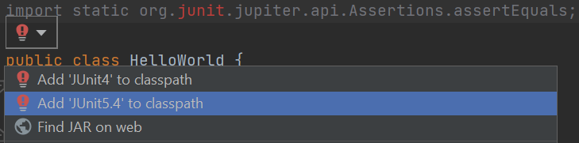
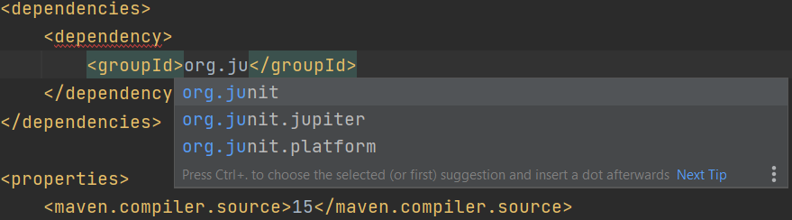

# KTH-DD2480-CI-Lab-2

## Developers
### Getting Started
* To start developing, you first need to have Maven installed. (Not sure if it comes with IntelliJ). You can check that it is installed by running `mvn --version` in your terminal/powershell.
* Clone this project to a location of choice, e.g `git clone ...`.
* Run `mvn clean install` in the root of the project folder, that is, same level were this README.md is located. This will download all the dependencies needed to run the project.
* To start the project, run `mvn exec:java "-Dexec.mainClass=ContinuousIntegrationServer"`. You can also run the project by running or debugging the main function in the ContinuousIntegrationServer class using an IDE. This would start a server on port 8080 that you can access in `http://localhost:8080/`. You can also access the frontend dashboard in `http://localhost:8080/dashboard`.
* To start the tests, run `mvn test`.

#### Frontend
* In order to get started on developing the frontend part of the CI, you will need node.js version 12 or later.
* You can start the frontend server by going running `npm install` and then `npm start` in the src/main/webapp/ci-frontend folder.
### Add New Dependencies
There are multiples ways to add dependencies to a maven project.  
* **Using IntelliJ**:  
  * Adding them to class path will automatically also add them to the pom.xml file. Example:  
* **Adding them manually**. 
  * IntelliJ might sometimes not find the package that we want to import. In these cases, the packages need to be manually added to the pom.xml file. You can either search only for the package and add the dependency in the pom.xml file. Or you can do the search in the pom.xml file itself:   

### Naming Conventions
#### Commit messages
* `#<issue-num> fix|feat|docs|test|style: <Description of commit>`
* Make sure last commit in PR follows the style above
* Local commits can be in any form descriptive to yourself/others, but should be explanatory
* The `<Description of commit>` should start with a capitalized letter

#### Branch name
* `issue/x-<description-of-branch>`

#### Edit P5
